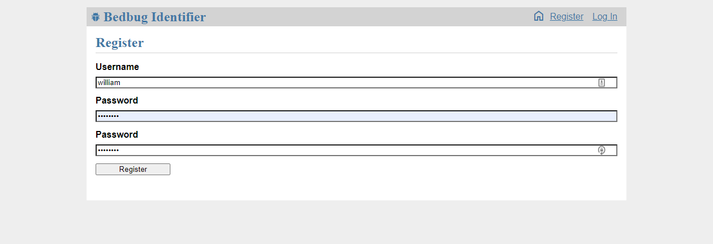
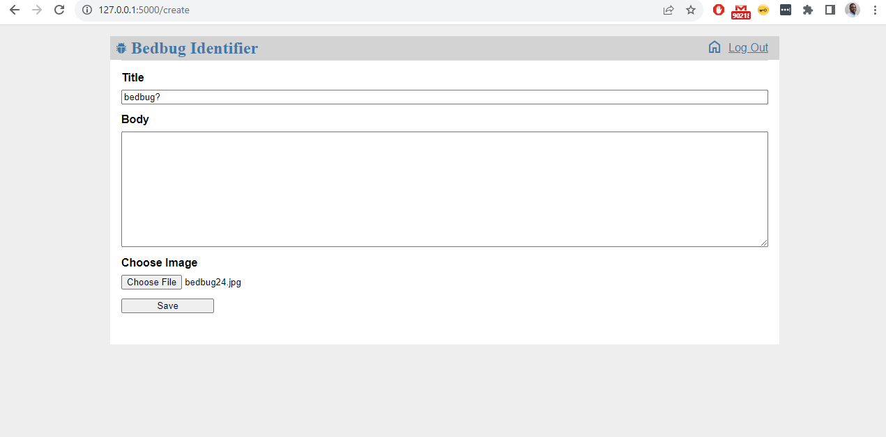
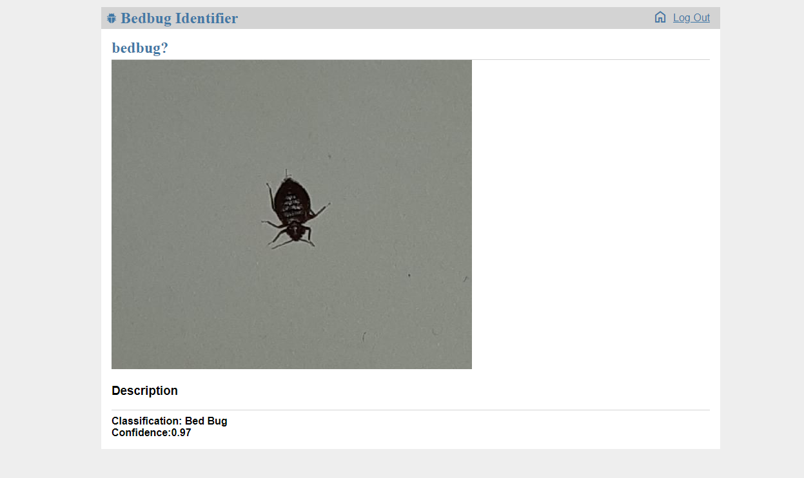

# Bed Bug Identification App
## Background
There is a Reddit Community called [r/whatsthisbug](https://www.reddit.com/r/whatsthisbug/) where users submit photos of bugs that they wish to be identified. A common question on this community is the "[Is this a bedbug? help!](https://www.reddit.com/r/whatsthisbug/comments/18da4ld/is_this_a_bedbug_help/)" question.
Bedbug questions are so common that there is a seperate community named [bedbugs](https://www.reddit.com/r/Bedbugs/) where users constantly ask if a bug is a bedbug, and wait for an "expert" 
Redditor to answer. In fact, as a human after seeing several dozen bedbug photos, most humans are able to classify them at a high rate. For my project, I used Machine Learning to train a model 
that will find patterns from many images (like a human would) and will classify images as having a bedbug (or not having a bedbug).

## How the App Works
### Registration
All first time users must register on the site. User must enter a username that is between 5-15 characters and they must also enter a password that is between 8-20 characters. 
The user has to repeat a matching password as well. After the user enters their password, they are redirected to the login page. 

### Login
In the login page, the user simply logs in, using the username and password that they registered with. After logging in, the user is redirected to the index page.

### Creating a Post
This time when the user is on the index page, they are logged and and can make posts. To make a post, the user should click on "New". Once the user clicks on "New" a form where the user enters a title and a description is present. The user must also submit their image here. When the user clicks submit, the image is sent to the a machine learning model that is hosted on Google Cloud. 

### Viewing Results 
The model returns its classfication of "Bed Bug" or "Not a Bed Bug" to the user, along with the probablity. A high probability means that the model is failrly certain, while a probability close to .50 means that the model is not sure. 

## Setting up the application locally 
1. To set up the application locally, users should first create a new virtual environemnt and install all of the packages listed in requirements.txt. 
2. Once the requirements are installed, the user should initialize a database. To initialize a database the user can run `flask --app bedbug_app init-db`.
3. Lastly, but very importantly, this project is using Google Cloud Storage to store photos, so the user must authenticate. A service account key is provided inside of the zip.

 Once the steps above are completed, the user can run the app by running `flask --app bedbug_app run`.

